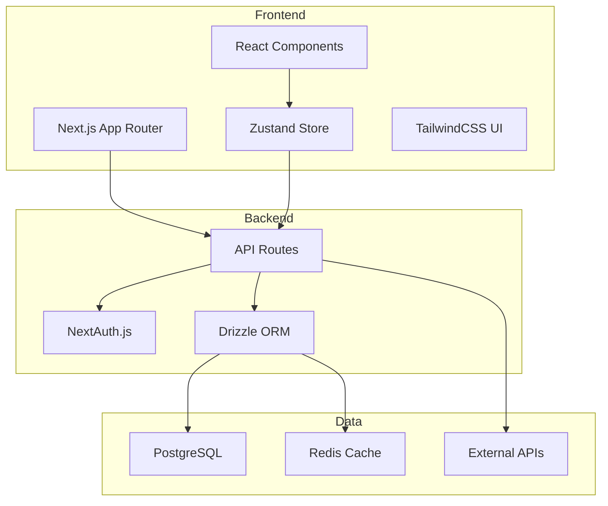

# Technical Specifications

**Project**: Corporate Brain  
**Stack**: Next.js 15 + React 19 + TypeScript + Drizzle ORM + PostgreSQL + TailwindCSS

## Architecture Overview



## Directory Structure

```
app/                    # Next.js App Router
├── api/               # API routes
├── (routes)/          # Page routes
db/                    # Database
├── schema.ts          # Drizzle schema
├── migrations/        # Database migrations
└── seeds/            # Seed data
components/            # React components
├── ui/               # UI components
├── forms/            # Form components
└── layout/           # Layout components
lib/                   # Utilities
├── utils.ts          # Helper functions
├── auth.ts           # Auth configuration
└── api/              # API clients
types/                 # TypeScript types
public/               # Static assets
```

## Key Dependencies

| Package     | Purpose          | Version        |
| ----------- | ---------------- | -------------- |
| next        | Framework        | ^15.0.0        |
| react       | UI Library       | ^19.0.0        |
| drizzle-orm | Database ORM     | ^0.30.0        |
| next-auth   | Authentication   | ^5.0.0-beta.15 |
| zustand     | State Management | ^4.5.0         |
| tailwindcss | Styling          | ^3.4.0         |
| zod         | Validation       | ^3.22.0        |

## Database Schema

See `db/schema.ts` for full schema definition.

## API Patterns

### Standard Response Format

```typescript
interface ApiResponse<T> {
  success: boolean;
  data?: T;
  error?: string;
  meta?: {
    page?: number;
    limit?: number;
    total?: number;
  };
}
```

### Error Handling

- Use Zod for input validation
- Return consistent error format
- Log errors server-side
- Show user-friendly messages client-side

## State Management

- Server state: React Server Components + API calls
- Client state: Zustand stores
- Form state: React Hook Form + Zod

## Testing Strategy

- Unit tests: Vitest
- E2E tests: Playwright
- Coverage target: 80%

## Performance Targets

- First Contentful Paint: < 1.5s
- Time to Interactive: < 3s
- Lighthouse score: > 90
