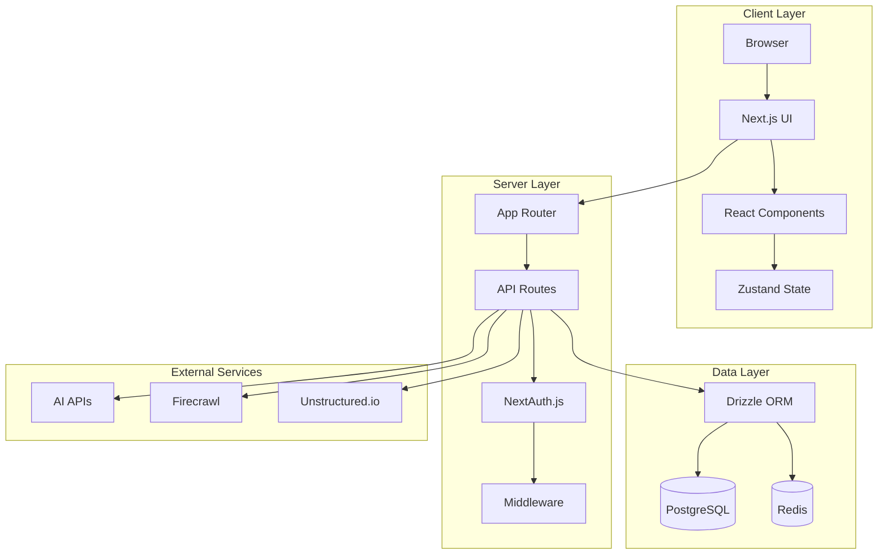
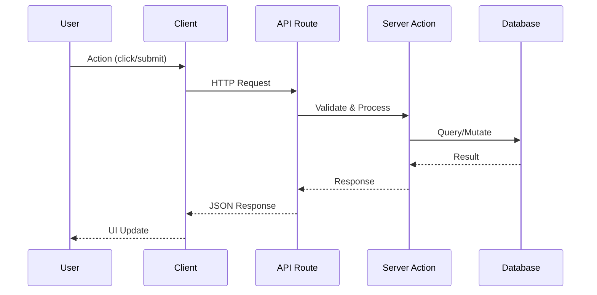
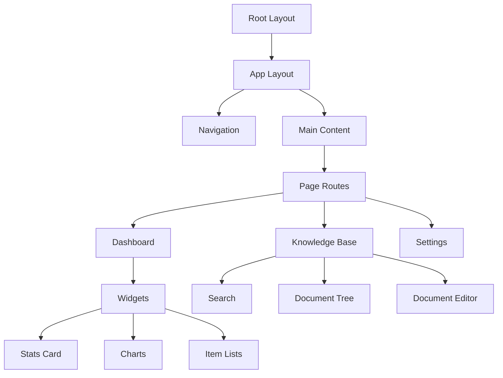
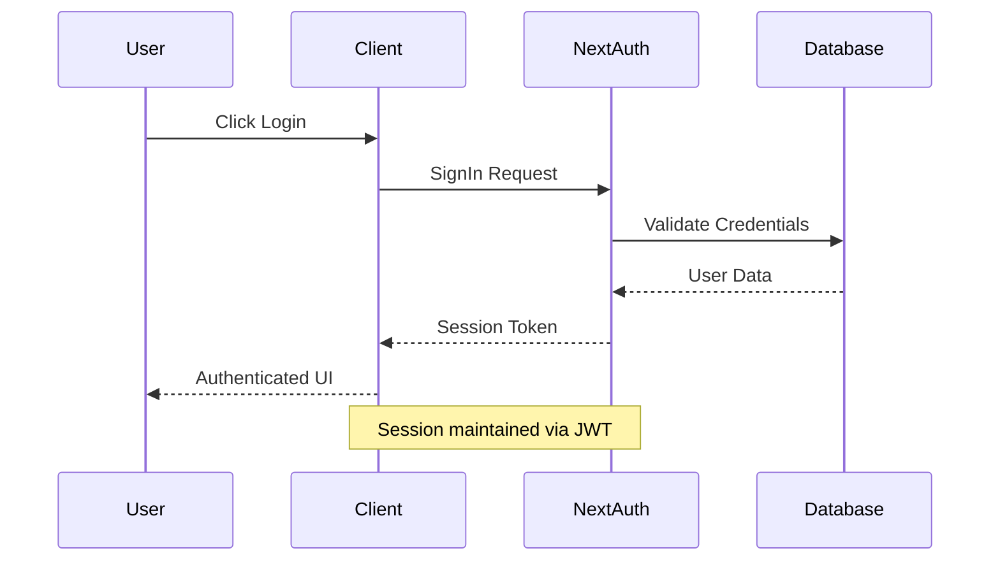
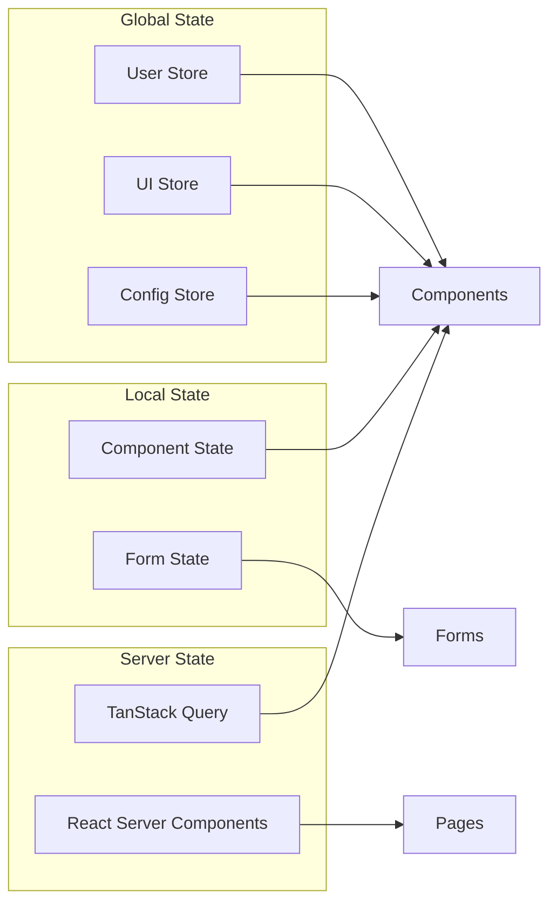
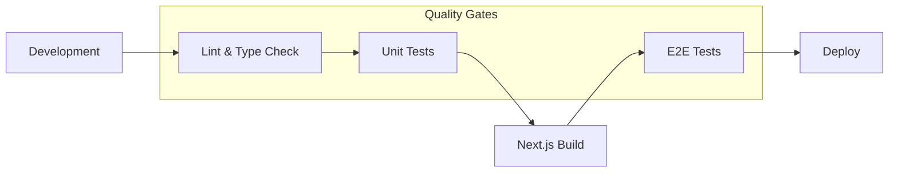
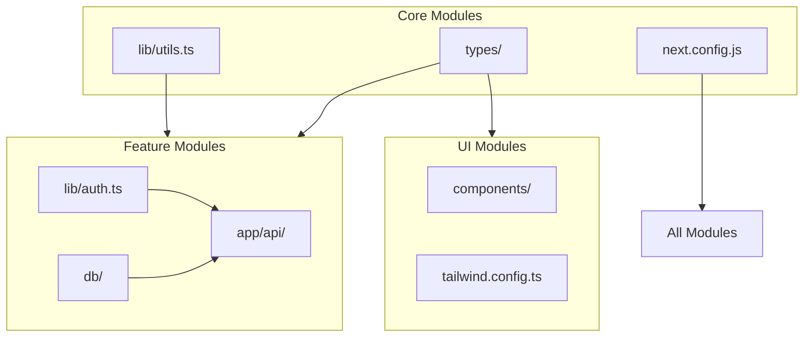
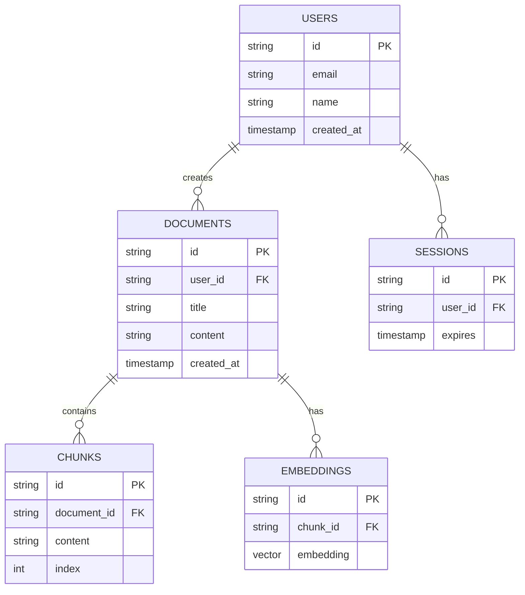
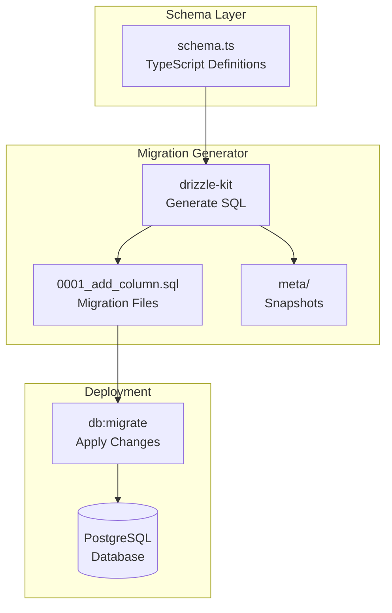
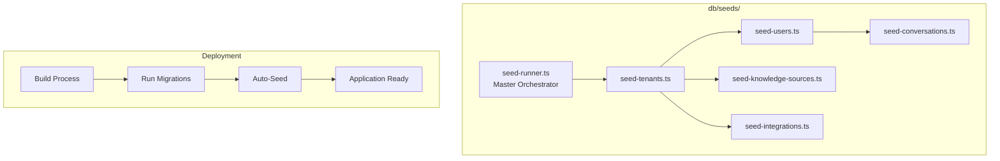

# Project Architecture

## System Overview



## Data Flow



## Component Hierarchy



## Authentication Flow



## State Management



## Build & Deploy Pipeline



## Module Dependencies



## Database Schema (Simplified)



## Database Migration System



### Migration Architecture

**Schema-First Design**: Define database schema in TypeScript, Drizzle Kit auto-generates SQL migrations.

**Auto-Generation**: When schema changes, run `npm run db:generate` to create migration files.

**Auto-Apply on Deploy**: Migrations run automatically during build via `prebuild` script.

**File Naming**: `0001_description.sql` - Sequential numbers ensure proper order.

### Migration Commands

| Command       | Purpose                        | Auto-Runs   |
| ------------- | ------------------------------ | ----------- |
| `db:generate` | Create SQL from schema changes | postinstall |
| `db:migrate`  | Apply pending migrations       | prebuild    |
| `db:studio`   | Browse/edit data               | Manual      |
| `db:reset`    | Wipe + migrate + seed          | Manual      |

### Migration Flow

1. **Developer** changes `@c:\Users\seoho\Documents\Corporate Brain\lib\db\schema.ts`
2. **Generate**: `npm run db:generate` creates `db/migrations/000X_description.sql`
3. **Commit**: Migration files committed to git
4. **Deploy**: `prebuild` runs `db:migrate` to apply changes
5. **Seed**: Then `db:seed` inserts initial data

---

## Database Seed System



### Seed Architecture

**Idempotent Design**: Every seed script checks for existing data before inserting. Safe to run multiple times without duplicates.

**Execution Order**:

1. `seed-tenants` - No dependencies
2. `seed-users` - Requires tenant
3. `seed-knowledge-sources` - Requires tenant
4. `seed-integrations` - Requires tenant
5. `seed-conversations` - Requires tenant + user

**Auto-Deployment**: Seeds run automatically during deployment via `npm run db:seed` which executes after migrations.

**Naming Convention**: `seed-{plural-noun}.ts` (e.g., `seed-users.ts`, `seed-materials.ts`)

### Commands

```bash
npm run db:seed      # Run all seeds
npm run db:reset     # Wipe, migrate, seed
npm run db:migrate   # Migrations only
```
